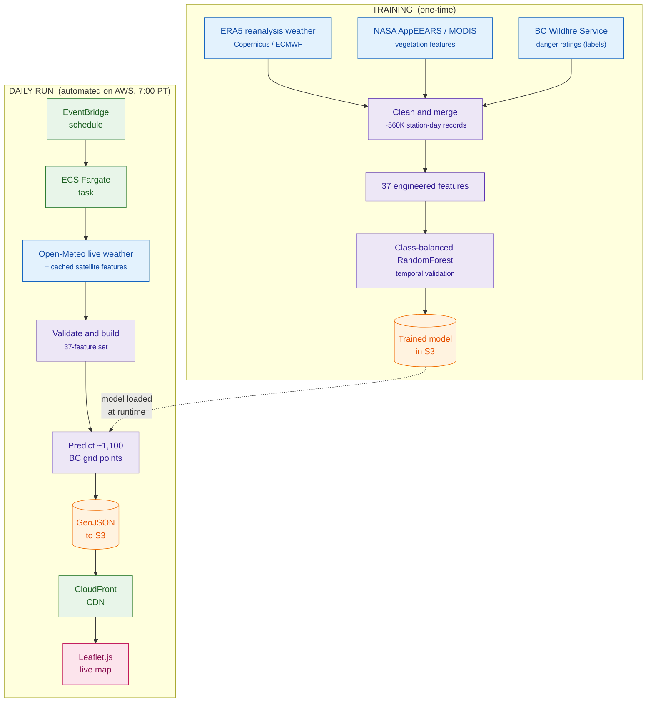

# BC Wildfire Danger Prediction System

An autonomous ML pipeline that predicts daily wildfire danger ratings (1–5, Low to Extreme) across British Columbia and publishes them to a live public map, updated every morning with no manual intervention.

**Live map:** https://dyzubavibswsp.cloudfront.net/index.html


## What it does

Every morning at 7:00 Pacific, a scheduled serverless job on AWS pulls live weather for ~1,100 grid points across BC, assembles a 37-feature input set, runs a trained RandomForest classifier, and publishes province-wide danger predictions as GeoJSON to an interactive Leaflet.js map served over a CDN.

## Architecture

The system has two phases: one-time training, and a fully automated daily inference run on AWS.



Training weather comes from ERA5 while live inference uses Open-Meteo, a deliberate train/serve source difference. The pipeline validates units and feature distributions between the two stages to keep them aligned (see Engineering notes below for why that matters).

## Model & validation

Class-balanced RandomForest over 37 engineered features, trained on ~560,000 station-day records, validated with a **temporal split** (train on earlier years, test on later) rather than a random split.

| Metric (temporal holdout) | Value |
|---|---|
| Exact rating match | ~55% |
| Within one danger level | ~94% |
| Quadratic weighted kappa | 0.77 |

A random train/test split scored ~66% exact match, but that number is inflated by same-period information leaking between train and test. The temporal split reflects true performance on unseen future days, so the lower, honest number is the one reported here.

## Engineering notes

- **Silent train/serve unit mismatch.** Training used ERA5 precipitation reported in metres, while the live serving stage running on AWS Fargate pulled Open-Meteo precipitation in millimetres: a 1000× discrepancy that silently corrupted the model's most important features. Nothing errored as it was caught when comparing feature distributions between the training and serving stages.
- **Model compression.** Hyperparameter profiling shrank the trained model ~10× (2.2 GB to 224 MB) with negligible accuracy loss, cutting AWS Fargate memory requirements ~4×.
- **Zero-touch operations.** A fully serverless AWS chain (EventBridge to Fargate to S3 to CloudFront) means no servers to maintain and no manual steps. The map updates itself every morning.

## Known limitations

- **Coastal bias.** Coastal/southwestern BC over-predicts by roughly +0.35 danger levels (near-zero bias in the interior and north). The map flags this region as lower-confidence.
- **Static vegetation features.** Satellite/MODIS features are a cached historical snapshot, not refreshed live, so they don't track within-season vegetation change. Weather inputs are fully live.
- **Independent project.** Not affiliated with or endorsed by the BC Wildfire Service.

## Repository structure


```
├── training/          # data prep, feature engineering, model training
├── daily_pipeline/    # Fargate task: fetch weather, build features, predict, publish
├── frontend/          # Leaflet.js map (index.html)
├── Dockerfile
├── requirements.txt
└── README.md
```

The trained model (~224 MB) and raw training data are **not stored in this repo**. The model lives in S3 and is pulled by the daily task at runtime.

## Deployment overview

The daily task is packaged as a Docker image, pushed to Amazon ECR, and run as a scheduled ECS Fargate task triggered by EventBridge. Predictions and static front-end assets are stored in S3 and served through CloudFront.

## Data sources

- [ERA5 reanalysis](https://cds.climate.copernicus.eu/): Copernicus Climate Change Service / ECMWF (historical weather, training)
- [Open-Meteo](https://open-meteo.com/): live weather (daily inference)
- [NASA AppEEARS](https://appeears.earthdatacloud.nasa.gov/): MODIS satellite/vegetation features
- [BC Wildfire Service](https://www2.gov.bc.ca/gov/content/safety/wildfire-status): official danger ratings (ground-truth labels)

Each source is used under its respective terms; this project is for research/portfolio purposes.

## Origins & attribution

This project began as a course group project at SFU ([original repo](https://github.com/izaakdonaldson/wildfire-risk)). <!-- TODO: add teammate names here if you'd like to credit them individually -->

This repository is the substantially extended individual version. The validation overhaul (temporal cross-validation), model improvements and compression, the automated daily pipeline, the full AWS deployment, and the live public map are individual work by [Andrei Sales](https://github.com/andrei-r-sales). <!-- TODO: verify this sentence matches exactly who did what. This is the sentence a recruiter will read. -->
